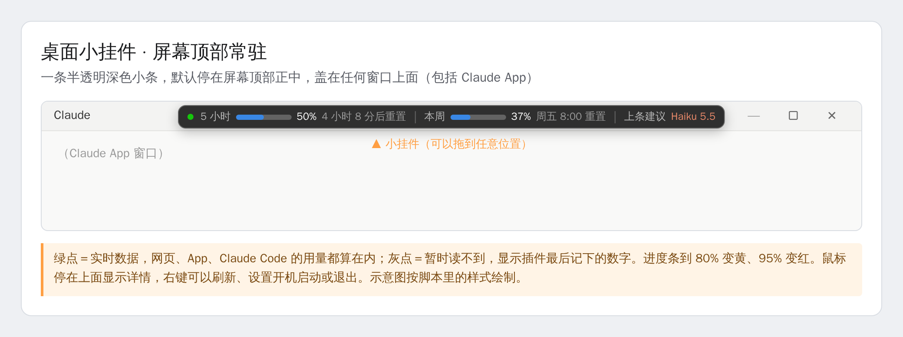
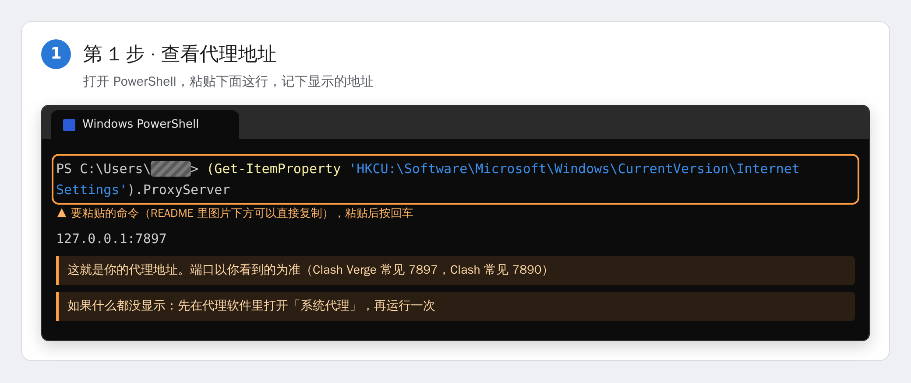
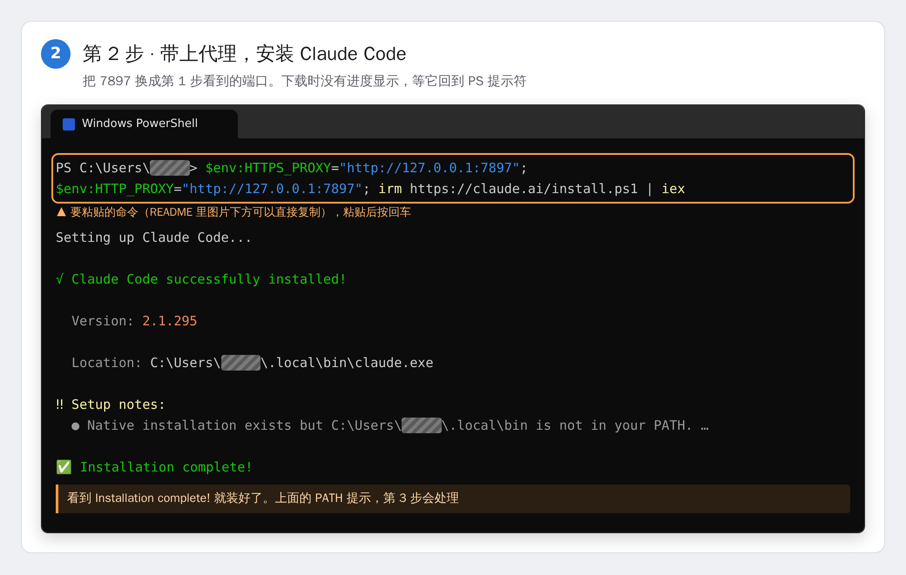
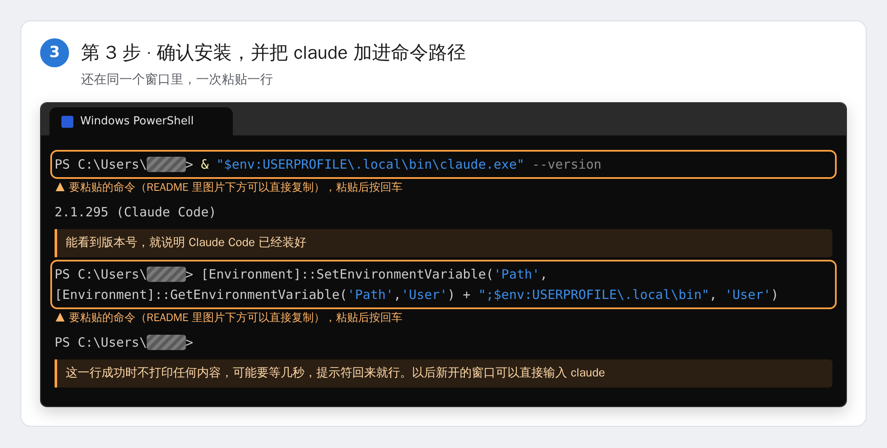
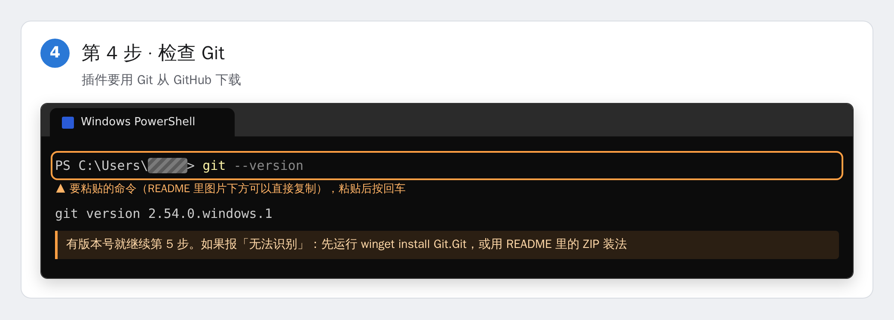
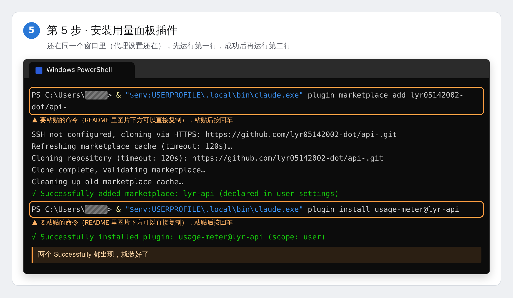
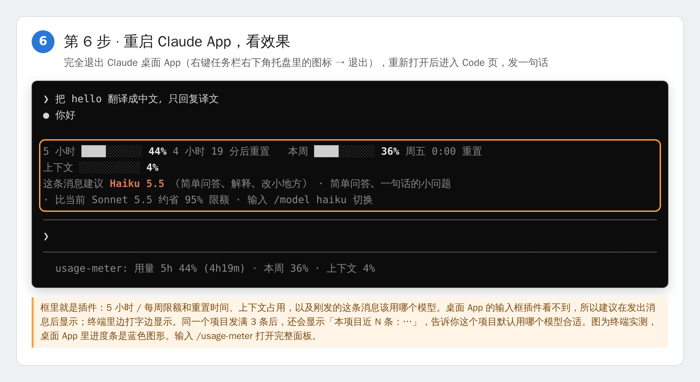

# Claude 用量面板（usage-meter）

一个 Claude Code 插件：打开 Claude Code（桌面 App 的 Code 页、终端或 VS Code），旁边就常驻一个「Claude 用量」面板。它把 App 用量弹窗里的数字一直摆在眼前（上下文窗口、5 小时会话限额、每周限额），记下每一轮对话的消耗，并告诉你这些消耗花在了哪里。

## 能看到什么

**输入框上方的用量条**（一直在，抬眼就能看到）：

```
5 小时 ████████░░░░ 61%  3 小时 44 分后重置     本周 █░░░░░░░░░ 10%  周五 8:00 重置     上下文 █░░░ 12%     本轮 45k tokens
```

桌面 App 里是和用量弹窗一样的蓝色进度条。用到 80% 变黄并加 ⚠，95% 变红并加 ⛔。正在进行的那一轮会实时显示用了多少 token、让限额涨了多少。点用量条旁边的 `[-]` 可以把它收起来。

**模型建议**：用量条下面会多出一行，分析你的问题，告诉你该用哪个模型：

- **桌面 App**：App 的输入框插件看不到，所以在你**发出消息后**马上显示「这条消息建议 …」，下一条就知道该不该换。
- **终端**：边打字边显示「建议模型 …」，发之前就能看到。
- **整个项目**：同一个项目发满 3 条后，会加上「本项目近 N 条：Sonnet 8、Haiku 3、Opus 1」，面板的概览页也会写「本项目建议默认用 …」，告诉你这个项目平时该把哪个模型设为默认。面板的「每轮」页会列出每条消息的建议模型。

```
这条消息建议 Haiku 5.5 （简单问答、解释、改小地方） · 简单问答 · 比当前 Sonnet 5.5 约省 95% 限额 · 输入 /model haiku 切换
这条消息建议 Opus 5.5 （复杂改动、排查难题、跨文件重构） · 大范围改动、难排查的问题 · 当前 Sonnet 5.5 可能不够，约多用 2.0 倍限额 · 本项目近 12 条：Sonnet 8、Haiku 3、Opus 1
```

| 模型 | 适合 | 相对用量（按 API 输入价） |
| --- | --- | --- |
| Haiku 5.5 | 简单问答、解释、翻译、改名、小改动 | 0.05×Sonnet |
| Sonnet 5.5 | 日常写代码、修 bug、加功能、写测试 | 1× |
| Opus 5.5 | 大范围重构、难排查的 bug（死锁、内存泄漏、偶发问题）、跨模块改动 | 2× |
| Fable 5.1 | 同时具备多种难点的超长需求、最难的推理 | 5× |

分析全在本地按关键词、长度、报错栈、提到的文件数和项目代码文件数来判断，不会为了给建议额外消耗额度。5 小时限额用到 80% 以后会自动降一档建议。对话已经很长时（超过 5 万 token），会提醒你换模型会让缓存失效，不一定省。这只是建议，切不切换由你决定。

**状态栏**（输入框下方）：

```
用量 5h 61% (3h44m) · 本周 10% · 上下文 12%
```

> Claude App 窗口顶部的标题栏是 App 自己的界面，插件画不到那里；输入框上方这条是插件能放的最显眼的位置。

**面板**有四页，按 `1`–`4` 或点按钮切换：

| 页 | 内容 |
| --- | --- |
| 概览 | 和 App 弹窗一样的三条进度条：上下文窗口、5 小时会话限额（几小时几分后重置）、每周限额（周几几点重置）。另外显示正在进行的这一轮、本窗口消耗最多的三项，以及本会话的轮数、token 数和按 API 价折算的金额。用到 80% 变黄，95% 变红，同时弹出提醒。 |
| 时间线 | 「限额走势」：5 小时限额和每周限额的百分比随时间变化的曲线。「每个时段用掉的 5 小时限额」：每个时间段涨了多少个百分点。可选 5 小时、24 小时、7 天；鼠标停在柱子上，能看到那段时间有几轮对话、用了多少 token、最耗的是哪条消息。 |
| 去向 | 消耗花在了哪里：你的消息和系统提示、重读历史上下文、回答与思考、每种工具（Bash、Read、Edit……）、MCP、子代理，以及「其他」（网页聊天、别的设备，或插件装上之前的用量）。还可以按项目、按模型看，最后列出当前上下文里都装了些什么。「重读历史上下文」占比太高时会提示你用 `/clear` 或 `/compact`。 |
| 每轮 | 最近 30 轮对话：时间、提问的开头、这一轮让 5 小时限额涨了多少（`+x%`）、token 数、请求次数、工具次数、子代理数、金额，以及主要花在哪一项。 |

面板关掉以后，输入 `/usage-meter` 就能重新打开。

## 桌面小挂件（Windows，屏幕顶部常驻）

插件只能画在 Claude Code 里面（终端、本地会话的输入框四周），Claude App 窗口顶部和聊天界面是 App 自己的，插件画不进去。想在屏幕最上方一直看到用量，就用这个小挂件：一条半透明的深色小条，默认停在屏幕顶部正中，盖在所有窗口上面。



**安装**：先按下面「安装」一节装好 Claude Code 并登录一次，然后在 PowerShell 里粘贴这一行，回车：

```powershell
$p = "$env:USERPROFILE\.claude\usage-widget.ps1"; irm https://raw.githubusercontent.com/lyr05142002-dot/api-/main/widget/usage-widget.ps1 -OutFile $p; Start-Process powershell -WindowStyle Hidden -ArgumentList "-NoProfile -ExecutionPolicy Bypass -File `"$p`""
```

屏幕顶部会出现小挂件。右键它，勾选「开机自动启动」，以后开机就会自动出现。

**它显示什么**
- 5 小时限额、每周限额的百分比和重置时间。进度条到 80% 变黄，95% 变红。
- 「上条建议」：usage-meter 插件给你上一条 Claude Code 消息的模型建议，一小时内有效。
- 左边的小圆点：**绿色**是实时数据，网页、App、Claude Code 的用量都算在里面；**灰色**是暂时读不到，显示的是插件最后一次记下的数字。鼠标停在小挂件上，会显示原因和详细时间。

**数据从哪来**：每 3 分钟读一次 Claude 的用量接口，也就是 Claude Code 里 `/usage` 用的那个。读的时候用的是 Claude Code 存在你电脑上的登录令牌（`.claude\.credentials.json`），只读，只发给 `api.anthropic.com`，不会发到别的地方。这个接口不是公开文档里的接口，以后可能会变；变了的话，小挂件会自动退回到插件记下的数字，圆点变灰。

**用法**：按住拖动可以换位置，下次打开还在那里。右键菜单里有：立即刷新、开机自动启动、回到屏幕顶部正中、退出。

**排查**：圆点一直是灰的，先看鼠标悬停时显示的原因。如果是"登录令牌已过期"，在 PowerShell 里运行一次 `claude`，它会自动刷新令牌。也可以运行下面这行，看它读到了什么：

```powershell
powershell -NoProfile -ExecutionPolicy Bypass -File "$env:USERPROFILE\.claude\usage-widget.ps1" -NoWindow
```

**卸载**：右键先取消「开机自动启动」，再点「退出」，然后删除 `%USERPROFILE%\.claude\usage-widget.ps1`。

## 安装（Windows，一步一步来）

只装了 Claude 桌面 App 的电脑上没有 `claude` 命令，要先装 Claude Code 命令行，再用它装插件。下面每一步都配了截图（用户名已打码），图下方就是要复制的命令。

**粘贴前先读一下这三点：**
- 一次只粘贴一行。粘贴前先按 `Esc` 清空输入行，粘贴后按回车，等它跑完、重新出现 `PS C:\Users\…>` 再粘下一行。不这样做，命令会和输入行里已有的字连在一起，报"不允许使用与号"或"包含意外的标记"。
- 第 2 到第 5 步都在**同一个** PowerShell 窗口里做，中途不要关。代理设置只在当前窗口有效。
- 截图里的 `7897` 是代理端口，要换成你第 1 步看到的那个。

### 第 1 步：查看代理地址



```powershell
(Get-ItemProperty 'HKCU:\Software\Microsoft\Windows\CurrentVersion\Internet Settings').ProxyServer
```

### 第 2 步：带上代理，安装 Claude Code



```powershell
$env:HTTPS_PROXY="http://127.0.0.1:7897"; $env:HTTP_PROXY="http://127.0.0.1:7897"; irm https://claude.ai/install.ps1 | iex
```

### 第 3 步：确认安装，并把 claude 加进命令路径



```powershell
& "$env:USERPROFILE\.local\bin\claude.exe" --version
```

```powershell
[Environment]::SetEnvironmentVariable('Path', [Environment]::GetEnvironmentVariable('Path','User') + ";$env:USERPROFILE\.local\bin", 'User')
```

### 第 4 步：检查 Git



```powershell
git --version
```

报"无法识别"就是没装 Git。可以运行 `winget install Git.Git` 先装上，或者跳过 Git，用下面的「不用 Git 的装法」。

### 第 5 步：安装用量面板插件



```powershell
& "$env:USERPROFILE\.local\bin\claude.exe" plugin marketplace add lyr05142002-dot/api-
```

```powershell
& "$env:USERPROFILE\.local\bin\claude.exe" plugin install usage-meter@lyr-api
```

### 第 6 步：重启 Claude App，看效果



一定要**完全退出** Claude 桌面 App：右键任务栏右下角托盘里的 Claude 图标，选退出。然后重新打开，进入 Code 页，先随便发一句话，输入框上方就会出现用量条。

### 不用 Git 的装法

1. 在浏览器打开 https://github.com/lyr05142002-dot/api-，点绿色的 **Code → Download ZIP**。
2. 把压缩包解压到「下载」文件夹，得到 `api--main` 文件夹。打开看一下：里面应该直接有 `usage-meter` 文件夹和 `README.md`。如果里面又套了一层 `api--main`，下面命令里的路径就写成 `Downloads\api--main\api--main`。
3. 用下面两行代替第 5 步：

```powershell
& "$env:USERPROFILE\.local\bin\claude.exe" plugin marketplace add "$env:USERPROFILE\Downloads\api--main"
```

```powershell
& "$env:USERPROFILE\.local\bin\claude.exe" plugin install usage-meter@lyr-api
```

这种装法以后要更新时，重新下载解压一次 ZIP，再执行下面「以后更新」里的命令。

### 以后更新

新开一个 PowerShell，一次一行：

```powershell
$env:HTTPS_PROXY="http://127.0.0.1:7897"; $env:HTTP_PROXY="http://127.0.0.1:7897"
```

```powershell
claude plugin update usage-meter@lyr-api
```

然后完全退出 Claude App 再打开。

### 常见报错

| 看到的报错 | 原因 | 怎么办 |
| --- | --- | --- |
| `无法将"claude"项识别为 cmdlet…` | Claude Code 命令行没装，或者还没加进命令路径 | 做第 2、3 步；第 3 步之后要新开窗口才能直接用 `claude` |
| `connect ECONNREFUSED …:443` | 安装程序没走代理，连不上下载服务器 | 用第 2 步那一整行，它会先设好代理再安装 |
| `不允许使用与号(&)` 或 `表达式或语句中包含意外的标记` | 粘贴的命令和输入行里已有的字连在了一起 | 先按 `Esc` 清空输入行，一次只粘贴一行 |
| 第 1 步什么都没显示 | 代理软件没开「系统代理」 | 在代理软件里打开「系统代理」，再做一次第 1 步 |
| `git` 无法识别 | 没装 Git | `winget install Git.Git`，或用「不用 Git 的装法」 |

### macOS / Linux

```bash
curl -fsSL https://claude.ai/install.sh | bash
claude plugin marketplace add lyr05142002-dot/api-
claude plugin install usage-meter@lyr-api
```

需要代理时，先运行 `export HTTPS_PROXY=http://127.0.0.1:端口`。已经装了 Claude Code 的话，也可以在 `claude` 里直接输入 `/plugin install usage-meter --marketplace lyr05142002-dot/api-`。

## 数据从哪来，准不准

- **限额百分比和重置时间**：来自 Claude 每次回复时 API 返回的限额读数，和 App 弹窗是同一个来源。读数只在 Claude 回复时更新：claude.ai 网页版和手机 App 也在用同一份限额，那边的用量要等 Claude Code 下次回复时才会体现出来，在「去向」里记作「其他」。
- **每轮的 token 数**：取自每次模型请求返回的 usage，是准确值。金额由 Claude Code 自己的计费账本算出，是按 API 价格折算的，订阅用户并不会真的被扣这笔钱。
- **「去向」的比例是估算**：一次请求的花费按 API 价格给 token 加权（缓存读 0.1 倍、缓存写 1.25 倍、输出 5 倍，Opus 比 Sonnet 贵，Sonnet 比 Haiku 贵），再分给引起这次请求的原因：
  - 每轮的第一次请求里新增的输入，算作「你的消息 / 系统提示」
  - 之后的请求里新增的输入，算作上一步工具返回的结果，多个工具按返回内容的长短分摊
  - 从缓存里重读之前的对话，算作「重读历史上下文」
  - 输出算作它调用的工具；没有调用工具时，算作「回答与思考」
  - 子代理里面的一切，都算作「子代理 Agent」
- **`+x%`**：两次限额读数之间涨了几个百分点，按上面的权重分给这段时间里的各轮对话。比的是所有会话里最新的那次读数，所以同时开着几个会话，同一份消耗也不会被重复算。如果上一次读数比这一轮开始早了 30 分钟以上，中间可能夹着网页版的用量，这段涨幅就记作「其他」，不算给这一轮，所以长时间空闲后的第一轮可能看不到 `+x%`；30 分钟以内的停顿，网页版的用量会混进这一轮里。API 读数最多只到一位小数，很小的一轮可能显示不出变化，没显示的部分会算到紧接着的下一轮。
- **数据存放**：只存在本机 Claude Code 的插件存储里，保留 8 天，其中包括每轮提问的前 80 个字。每个会话只写自己的那份记录，面板显示时再把所有会话的合在一起，所以多个会话同时开着也不会互相覆盖。

## 开发

```
claude plugin validate .
claude plugin test usage-meter
```

代码在 `usage-meter/hooks/` 下：`register.tsx` 负责挂接事件和绘制面板，`model.ts` 负责归因、合并和格式化（纯函数），`charts.ts` 负责生成 SVG 图表。状态的类型约定写在 `usage-meter/types/index.d.ts`。
